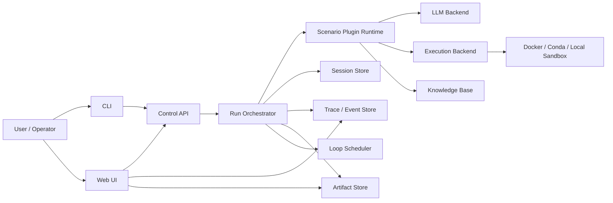
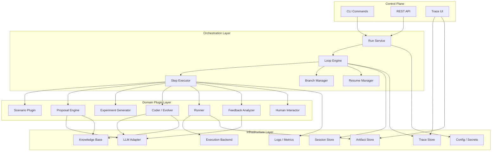
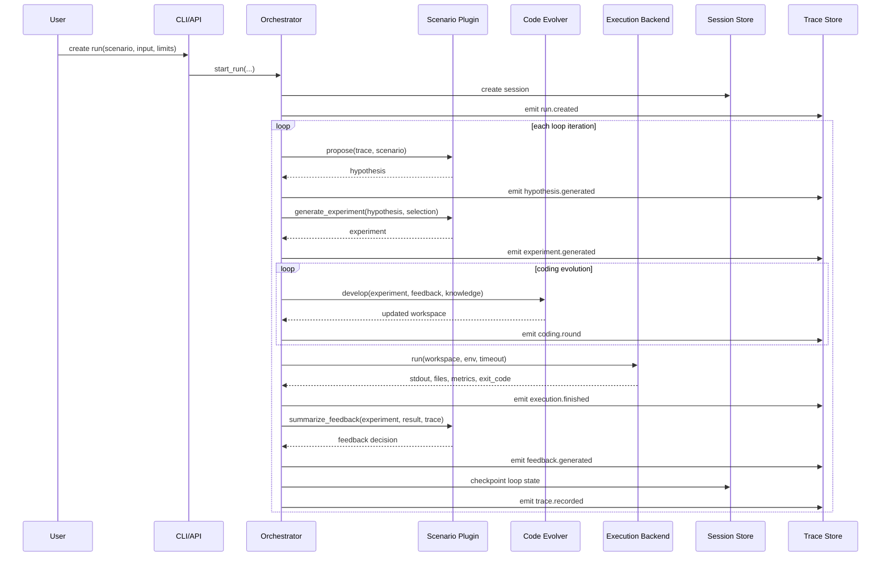
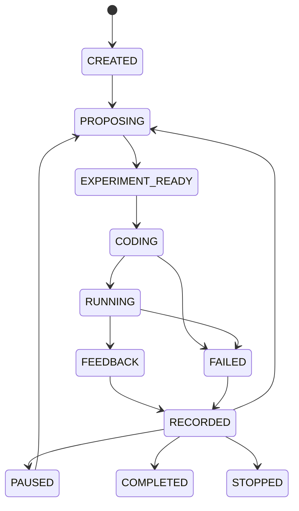
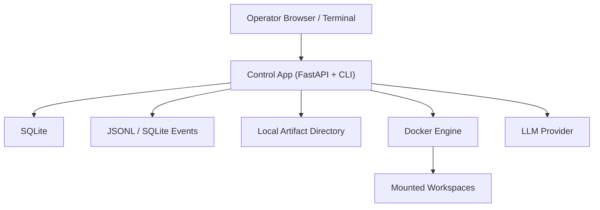
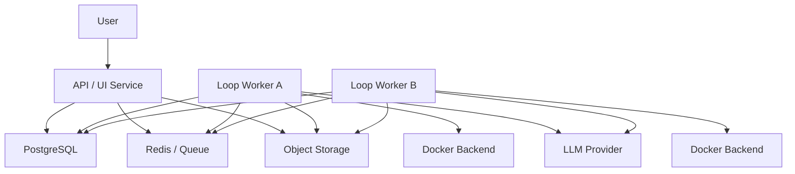

# Agentic R&D Platform Architecture

> Status: reverse-engineered, implementation-ready design  
> Purpose: this document is written for a coding agent or engineering team that needs to build a system with functionality similar to `RD-Agent`, without requiring line-by-line code cloning.

## 1. Scope

This architecture targets a system that can:

- run iterative R&D loops driven by LLMs
- support multiple scenarios through plugins
- generate, modify, run, and evaluate code inside controlled environments
- persist execution state for pause, resume, replay, and branching
- expose both CLI and service interfaces
- provide a UI for trace inspection and control

The architecture intentionally favors clear module boundaries and incremental implementation over perfect parity with the source project.

## 2. Design Goals

- `G1` Plugin-first: new scenarios should be added by implementing a bounded set of interfaces.
- `G2` Recoverable: every run must be resumable from the latest successful step.
- `G3` Executable: generated code must run in a sandboxed, timeout-bound environment.
- `G4` Observable: every proposal, code diff, execution result, and feedback decision must be inspectable.
- `G5` Evolvable: coding is multi-round refinement, not single-shot generation.
- `G6` Branchable: the system must support multiple experiment branches off previous checkpoints.
- `G7` Deployable: the MVP must work on one machine; later versions may scale to multi-worker.

## 3. Explicit Non-Goals

- `NG1` General-purpose autonomous browsing agent
- `NG2` Full IDE replacement
- `NG3` Perfect reproduction of every RD-Agent scenario
- `NG4` Hard real-time scheduling
- `NG5` Arbitrary untrusted code execution without sandboxing

## 4. System Context



## 5. Logical Architecture



## 6. Canonical Runtime Sequence



## 7. Core Architectural Decisions

### 7.1 Single Generic Loop Engine

The engine should not hardcode "Kaggle", "Quant", or "Paper" logic. It should only understand a generic step graph:

1. `propose`
2. `experiment_generation`
3. `coding`
4. `running`
5. `feedback`
6. `record`

Scenario-specific behavior belongs in plugins.

### 7.2 Plugin Composition Over Monoliths

Each scenario is composed from replaceable parts:

- `ScenarioPlugin`
- `ProposalEngine`
- `ExperimentGenerator`
- `Coder`
- `Runner`
- `FeedbackAnalyzer`
- optional `Interactor`

This is the minimum granularity that still allows meaningful reuse.

### 7.3 Sandboxed Execution Is a First-Class Subsystem

Generated code is not a side effect. It is a product artifact that must be:

- written into a workspace
- executed in a chosen backend
- bounded by timeout
- isolated from host side effects as much as possible
- accompanied by artifacts and logs

### 7.4 Trace Is a DAG, Not a Flat List

To support branch exploration and checkpoint restart, the trace model must allow:

- parent-child relationships
- branch heads
- best-so-far selection
- pending uncommitted experiments

### 7.5 Session Persistence After Every Step

Persist after each successful step, not only after each loop. This drastically reduces wasted work after crashes or manual pauses.

## 8. Component Responsibilities

### 8.1 Control Plane

`CLI`

- start runs
- resume runs
- stop runs
- run health checks
- launch UI

`REST API`

- create run
- query run status
- pause/resume/stop
- stream or page trace events
- list artifacts

`UI`

- display loop timeline
- inspect hypotheses, code, outputs, feedback
- compare branches
- show metrics trends

### 8.2 Orchestration Layer

`RunService`

- validate requests
- instantiate scenario plugin bundle
- allocate run/session IDs

`LoopEngine`

- coordinate iterations
- enforce stop conditions
- manage semaphores and per-step concurrency

`StepExecutor`

- invoke each step
- normalize outputs
- surface step-level exceptions

`BranchManager`

- apply parent selection
- create new branches
- track branch heads

`ResumeManager`

- restore a run from latest or requested checkpoint
- optionally truncate future state when resuming from history

### 8.3 Domain Plugin Layer

`ScenarioPlugin`

- build scenario context
- describe input data and runtime environment
- expose domain-specific limits and formatting rules

`ProposalEngine`

- analyze previous trace and generate a hypothesis or plan

`ExperimentGenerator`

- convert hypothesis into executable tasks and initial workspace

`Coder`

- refine code over multiple rounds
- optionally query knowledge base
- select the best acceptable intermediate version

`Runner`

- execute experiment
- collect metrics, output files, runtime stats

`FeedbackAnalyzer`

- compare current result to historical SOTA or branch baseline
- decide accept/reject/promote

`Interactor`

- optional human-in-the-loop stage to add instructions or approve transitions

### 8.4 Infrastructure Layer

`LLMAdapter`

- chat completion
- structured output mode
- embedding
- per-step model overrides

`ExecutionBackend`

- run workspace in docker / conda / local backend
- mount volumes
- enforce timeout
- return stdout, exit code, runtime, artifacts

`SessionStore`

- persist serialized loop state
- retrieve by run ID / checkpoint

`TraceStore`

- append immutable events
- support filtering by run, loop, step, branch

`ArtifactStore`

- keep workspaces, outputs, reports, diff summaries, plots

`KnowledgeBase`

- store successful ideas, failed attempts, reusable snippets, embeddings

## 9. Canonical Data Model

The following entities are sufficient for an implementation-ready MVP.

### 9.1 RunSession

```json
{
  "run_id": "run_20260306_001",
  "scenario": "data_science",
  "status": "RUNNING",
  "created_at": "2026-03-06T10:00:00Z",
  "updated_at": "2026-03-06T10:05:00Z",
  "stop_conditions": {
    "max_loops": 20,
    "max_steps": null,
    "max_duration_sec": 14400
  },
  "entry_input": {
    "competition": "playground-series-s4e9"
  },
  "active_branch_ids": ["main"]
}
```

### 9.2 ExperimentNode

```json
{
  "node_id": "node_17",
  "run_id": "run_20260306_001",
  "branch_id": "main",
  "parent_node_id": "node_12",
  "loop_index": 5,
  "step_state": "RECORDED",
  "hypothesis": {
    "text": "Add a stronger feature engineering stage for categorical leakage handling.",
    "component": "FeatureEng"
  },
  "workspace_ref": "artifacts/run_20260306_001/node_17/workspace",
  "result_ref": "artifacts/run_20260306_001/node_17/result",
  "feedback_ref": "trace:event_1021"
}
```

### 9.3 WorkspaceSnapshot

```json
{
  "workspace_id": "ws_17",
  "run_id": "run_20260306_001",
  "file_manifest": [
    {"path": "main.py", "sha256": "abc"},
    {"path": "feature/transform.py", "sha256": "def"}
  ],
  "checkpoint_type": "zip",
  "created_at": "2026-03-06T10:03:00Z"
}
```

### 9.4 FeedbackRecord

```json
{
  "feedback_id": "fb_17",
  "decision": true,
  "acceptable": true,
  "reason": "Validation score improved from 0.811 to 0.824 with stable runtime.",
  "observations": "New categorical preprocessing fixed a target leakage issue.",
  "code_change_summary": "Added grouped target encoding with fit/transform separation."
}
```

## 10. Loop State Machine



## 11. Plugin Contracts

The system should formalize plugin contracts. A coding agent can implement these directly.

```python
from __future__ import annotations
from dataclasses import dataclass
from typing import Protocol, Any

@dataclass
class ScenarioContext:
    run_id: str
    scenario_name: str
    input_payload: dict[str, Any]
    runtime_description: str
    dataset_description: str

@dataclass
class Hypothesis:
    text: str
    reason: str
    component: str | None = None

@dataclass
class Experiment:
    hypothesis: Hypothesis
    tasks: list[dict[str, Any]]
    workspace_path: str | None
    branch_parent: str | None

@dataclass
class RunResult:
    exit_code: int
    runtime_sec: float
    stdout: str
    metrics: dict[str, float]
    artifact_paths: list[str]

@dataclass
class Feedback:
    decision: bool
    acceptable: bool
    reason: str
    observations: str = ""
    code_change_summary: str = ""

class ScenarioPlugin(Protocol):
    def build_context(self, input_payload: dict[str, Any]) -> ScenarioContext: ...

class ProposalEngine(Protocol):
    def propose(self, trace: "TraceView", context: ScenarioContext) -> Hypothesis: ...

class ExperimentGenerator(Protocol):
    def generate(self, hypothesis: Hypothesis, trace: "TraceView") -> Experiment: ...

class Coder(Protocol):
    def develop(self, exp: Experiment, trace: "TraceView") -> Experiment: ...

class Runner(Protocol):
    def run(self, exp: Experiment, context: ScenarioContext) -> tuple[Experiment, RunResult]: ...

class FeedbackAnalyzer(Protocol):
    def summarize(self, exp: Experiment, result: RunResult, trace: "TraceView") -> Feedback: ...
```

## 12. External Interfaces

### 12.1 CLI

Minimum commands:

- `agentrd run --scenario <name> --input <json-or-file>`
- `agentrd resume --run-id <id> [--checkpoint <step>]`
- `agentrd pause --run-id <id>`
- `agentrd stop --run-id <id>`
- `agentrd trace --run-id <id>`
- `agentrd ui`
- `agentrd health-check`

### 12.2 REST API

Minimum endpoints:

- `POST /runs`
- `GET /runs/{run_id}`
- `POST /runs/{run_id}/pause`
- `POST /runs/{run_id}/resume`
- `POST /runs/{run_id}/stop`
- `GET /runs/{run_id}/events`
- `GET /runs/{run_id}/artifacts`
- `GET /health`

### 12.3 Event Schema

Every event should include:

- `event_id`
- `run_id`
- `branch_id`
- `loop_index`
- `step_name`
- `event_type`
- `timestamp`
- `payload`

Recommended event types:

- `run.created`
- `hypothesis.generated`
- `experiment.generated`
- `coding.round`
- `execution.finished`
- `feedback.generated`
- `trace.recorded`
- `run.paused`
- `run.resumed`
- `run.stopped`

## 13. Persistence Strategy

### 13.1 MVP Persistence

Use:

- `SQLite` for run/session metadata
- append-only JSONL or SQLite table for trace events
- local filesystem for artifacts and workspace checkpoints

This is sufficient for a single-host implementation and is far easier for a coding agent to ship.

### 13.2 Scale-Out Persistence

For multi-worker scale:

- `PostgreSQL` for metadata and event index
- object storage for artifacts
- Redis or database-backed queue for scheduling

## 14. Deployment View

### 14.1 Single-Host MVP



### 14.2 Multi-Worker V1+



## 15. Suggested Repository Structure

```text
agentrd/
  app/
    api/
    cli/
    ui/
  core/
    models/
    loop/
    plugins/
    storage/
    events/
  execution/
    backends/
    workspace/
  llm/
    adapter.py
    schemas.py
  scenarios/
    data_science/
    quant/
    paper_model/
  tests/
    unit/
    integration/
```

Suggested ownership:

- `core/models`: run session, experiment node, feedback, artifacts
- `core/loop`: scheduler, step executor, resume logic, branching
- `core/plugins`: plugin protocols and registry
- `core/storage`: metadata, checkpoints, artifacts
- `execution/backends`: docker / conda / local execution
- `scenarios/*`: actual scenario implementations

## 16. Concurrency and Recovery

### 16.1 Concurrency Rules

- proposal, coding, and running may execute concurrently across loops
- feedback and record should be serialized per run to avoid inconsistent branch state
- each run may define per-step concurrency limits

### 16.2 Recovery Rules

- checkpoint after each successful step
- on resume, restore the latest checkpoint unless a historical checkpoint is requested
- if resuming from historical checkpoint, allow either:
  - `truncate_future=true`
  - `fork_branch=true`

The second option is safer and should be preferred in a multi-user product.

## 17. Security and Sandbox

Minimum safeguards:

- execute generated code only in isolated backends
- enforce CPU / memory / timeout boundaries where possible
- mount only required directories
- redact secrets from traces
- separate operator credentials from generated workspace content
- never let generated code directly mutate control-plane state

## 18. Recommended Implementation Stack

For a new implementation, use this default stack unless there is a strong reason not to:

- `Python 3.11`
- `FastAPI` for REST API
- `Typer` for CLI
- `Pydantic` for schemas
- `asyncio` for loop orchestration
- `SQLite` first, `PostgreSQL` later
- local filesystem artifact store first
- `Docker SDK` for sandbox execution
- `LiteLLM`-style adapter for multi-provider LLM support
- `Streamlit` or simple React frontend for trace viewer

## 19. Recommended Build Order

If another coding agent is building this system, implement in this order:

1. domain schemas and plugin interfaces
2. local loop engine with single-threaded execution
3. filesystem workspace manager and execution backend
4. event store and checkpointing
5. one scenario plugin end-to-end
6. CLI controls
7. pause/resume and branch support
8. REST API
9. trace UI
10. knowledge base and multi-worker scale

## 20. MVP Architecture Cut

The smallest meaningful version should include:

- single-host deployment
- one scenario plugin
- one execution backend
- local artifact store
- trace events
- checkpoint resume
- CLI
- minimal web trace viewer

The following can wait until `v1`:

- multi-scenario marketplace
- advanced knowledge base
- branch merge heuristics
- model-per-step routing
- remote worker pool

## 21. Handoff Note For Coding Agents

When implementing a similar system, do not start from UI or prompt tuning. Start from:

- durable state model
- workspace lifecycle
- execution backend
- plugin contracts
- loop persistence

If those are correct, the LLM prompting layer can evolve. If those are weak, the system will remain a demo.
